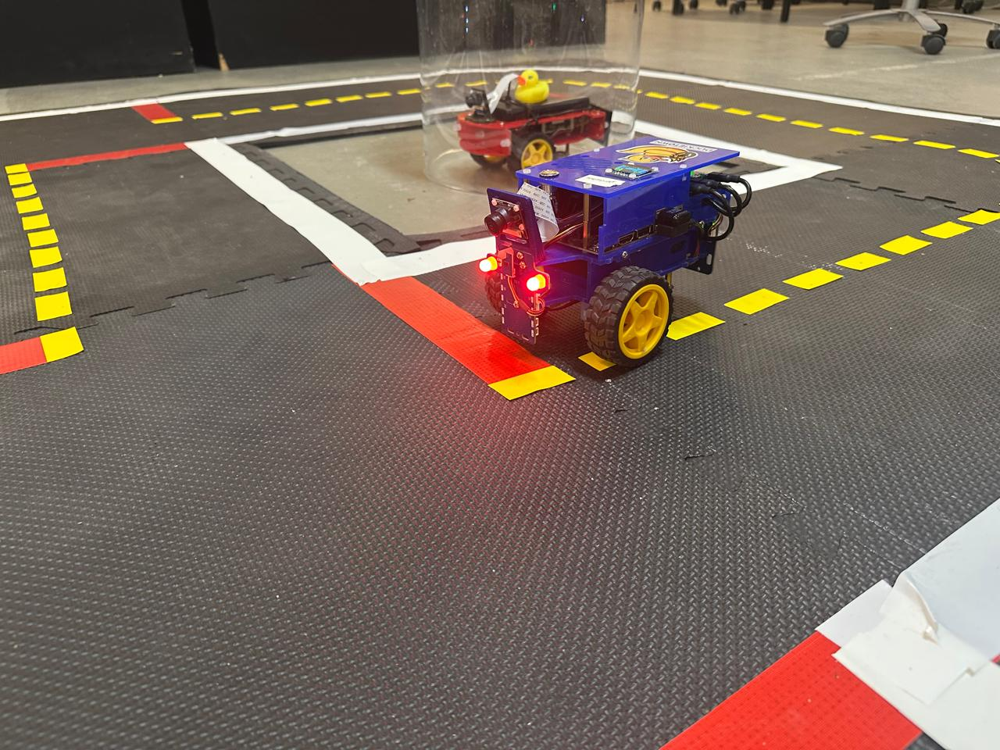
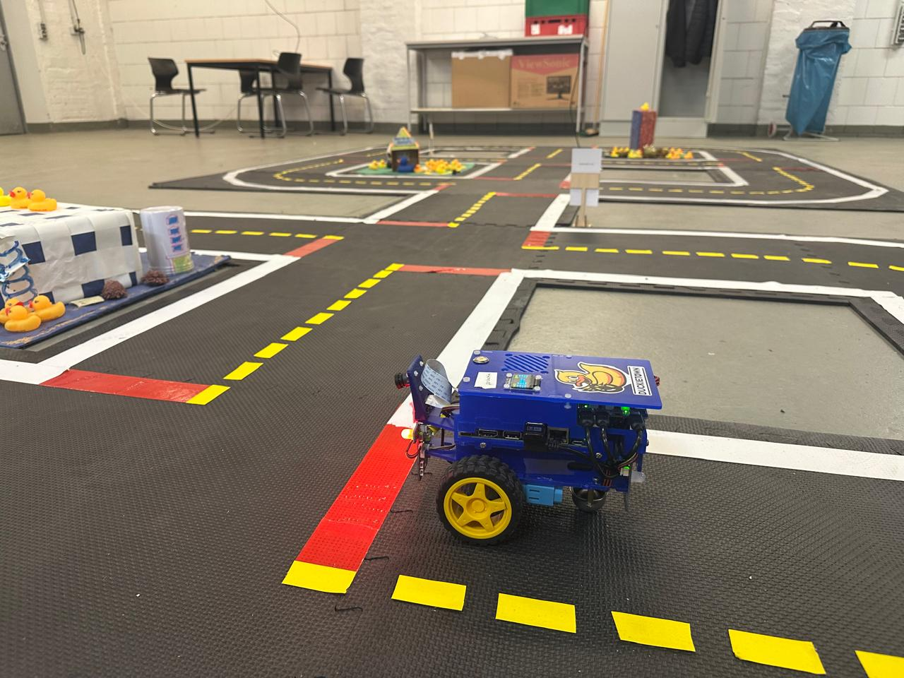
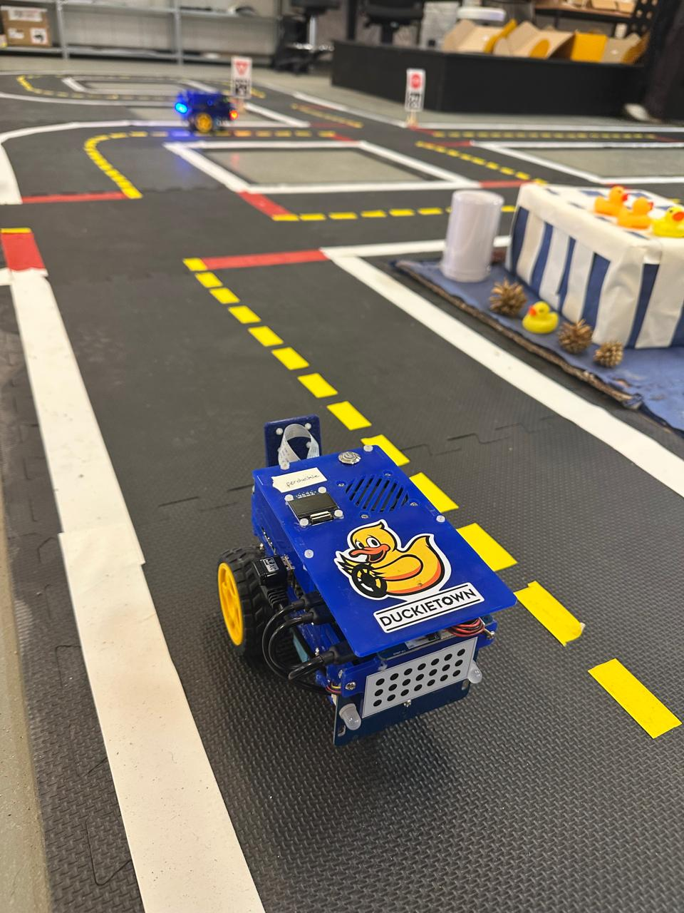
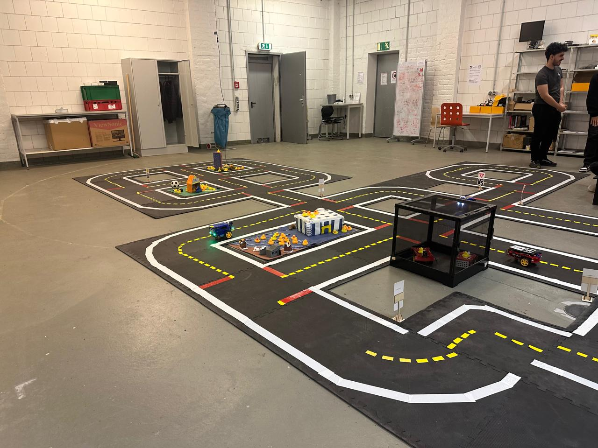

# Duckiebot Autonomous Navigation

This repository contains the ROS node I wrote for a stop-and-go behavior on a Duckiebot differential-drive robot. It was the final assignment of the Robotics and Intelligent Systems II course at Constructor University Bremen, where we worked with a physical Duckietown environment: a scaled-down city built on foam mats with lanes, intersections, and red stop lines.


---

## What This Does

The Duckietown stack already handles lane following; the robot drives autonomously using camera-based line detection and a PID controller. My job was to build a node on top of that which makes the robot behave correctly at red stop lines.

When the robot detects a red stop line ahead, it:
- Interrupts lane following by switching the FSM to joystick control mode
- Sends a zero-velocity command to stop the wheels
- Turns the two front LEDs red as a visual indicator
- Waits 5 seconds
- Resets the LEDs and resumes lane following
- Ignores new detections for a short cooldown period so the robot has time to physically cross the line before re-enabling detection

The robot we used was named Ferduckie.

---

## Demo

Robot stopped at the red line with front LEDs glowing red:




Robot navigating the lane in the full Duckietown environment:



Overview of the Duckietown track used for testing:



---

## How It Works

The Duckietown perception stack publishes ground-projected line segments on a ROS topic. Each segment has a color label: white (0), yellow (1), or red (2), and two 3D points giving its position in the robot's footprint frame, where x is forward and y is sideways.

I filter those segments to find red stop lines:

1. Keep only segments labeled red (color == 2)
2. Compute the midpoint of each segment
3. Reject segments that are too close, too far, or too far to the side using configurable thresholds
4. If at least `required_segments` pass the filter in a single message, trigger the stop behavior

I intentionally left out an orientation filter I tried earlier that checked whether the segment was more horizontal than vertical. In theory a stop line should be roughly perpendicular to the direction of travel, so segments should vary more in y than in x. In practice, the robot is never perfectly aligned when it approaches a line, and the filter was rejecting too many valid detections. Position-based filtering alone turned out to be reliable enough.

The stop behavior itself runs on a timer rather than blocking inside the callback with `rospy.sleep()`. I learned the hard way that sleeping inside a ROS callback blocks the thread and makes the node unresponsive to external commands, which caused problems when trying to stop the robot manually during testing.

---

## Project Structure

```
duckiebot-autonomous-navigation/
├── src/
│   └── stop_and_go.py     # ROS node: red line detection and stop-and-go behavior
├── media/                 # Photos of the robot and environment
├── package.xml            # ROS package metadata
├── CMakeLists.txt         # ROS build configuration
└── README.md
```

---

## Running the Node

ROS must be running and the robot container must be active on the Duckiebot.

```bash
# Connect to the robot's ROS master
export ROS_MASTER_URI=http://ferduckie.local:11311
export ROS_IP=<your-ip>

# Start lane following
rostopic pub -1 /ferduckie/fsm_node/mode duckietown_msgs/FSMState "{state: 'LANE_FOLLOWING'}"

# In a separate terminal, run the node
rosrun duckiebot_stop_and_go stop_and_go.py
```

---

## Parameters

These are all set at the top of `__init__` in `stop_and_go.py` and can be adjusted without changing the logic.

| Parameter | Value | Description |
|---|---|---|
| `min_x` | 0.10 m | Minimum forward distance to consider a segment |
| `max_x` | 0.50 m | Maximum forward distance to consider a segment |
| `max_abs_y` | 0.25 m | Maximum lateral offset of a segment |
| `required_segments` | 3 | Number of qualifying red segments needed to trigger |
| `stop_time` | 5.0 s | How long the robot stays stopped |
| `cooldown_time` | 4.0 s | How long detection is disabled after resuming |

The most sensitive ones in practice were `required_segments` and `max_x`. Too few required segments and the robot stops randomly; too many and it misses real stop lines. `max_x` controls how far ahead the robot starts looking: increasing it gave more time to react at higher speeds.

---

## Hardware Calibration

Two kinematic parameters on the robot needed tuning before the lane following was reliable enough to test the stop behavior:

- **trim**: corrects for wheel asymmetry. Our robot drifted left at the default value of 0.0, so we set it to -0.1
- **gain**: overall wheel speed multiplier. At the default of 1.0 the robot moved slowly and got stuck on uneven mat joints, so we increased it to 1.2

These are set at runtime with `rosparam set` and don't require restarting the node.

---

## Current Limitations

- The detection thresholds were tuned specifically for Ferduckie and the Duckietown environment at Constructor University. They may need adjustment on a different robot or track
- The node relies on the Duckietown ground projection stack being active. It doesn't do its own image processing
- There's no handling for the case where the robot stops but lane following fails to resume cleanly (e.g. if the FSM is in an unexpected state)

---

## Technologies

- ROS Noetic
- Python 3
- Duckietown platform
- Ubuntu 20.04

---

## Context

This was the last assignment of the RIS Lab II course, which ran over an entire semester. Earlier assignments covered SSH and Docker setup on the Duckiebot, teleoperation, trim and gain calibration, and lane following configuration. By the time we got to this one we already had a working understanding of the Duckietown ROS stack, which made it easier to figure out which topics to use and how the FSM worked.

The physical Duckietown at Constructor University has multiple robots running simultaneously on the same track, which made testing interesting and challeging. We had other teams' robots in the background while debugging on our own.

---

## Author

Leonel Valdez — [github.com/leonelvaldez](https://github.com/leonelvaldez)